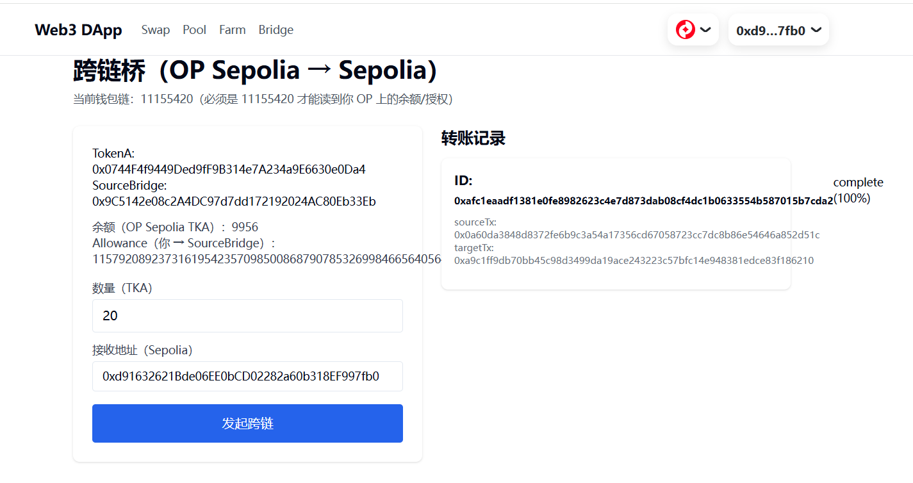
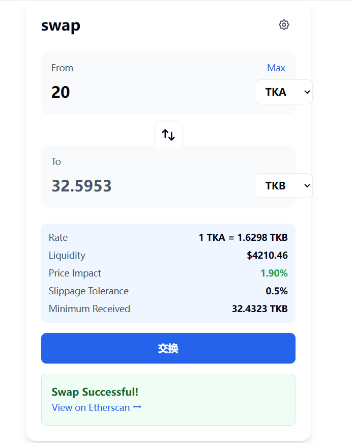
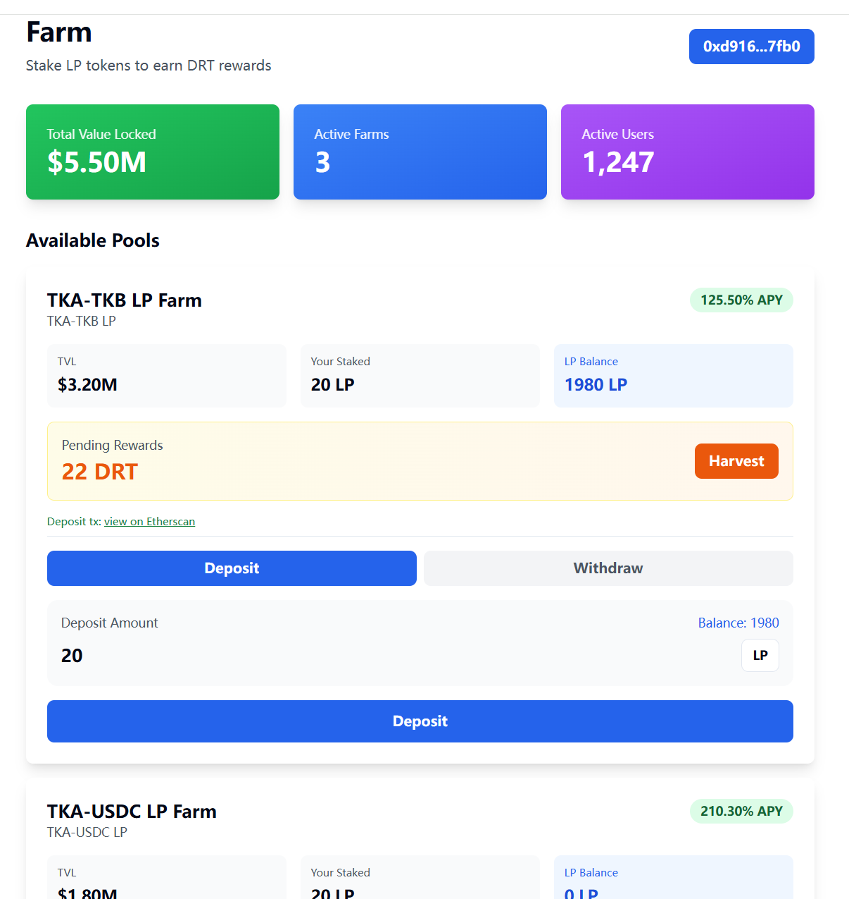
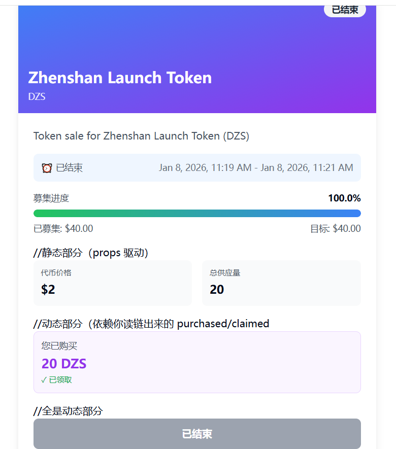

# Web3 DApp 套件（DeFi + Bridge）— Next.js + wagmi/viem

**在线演示（Live Demo）：** https://web3-dapp-two.vercel.app/  
**链上证明（On-chain Proofs）：** `docs/proofs.md`

一个偏工程化落地的 Web3 DApp 项目集合，包含 **Swap/Pool（AMM）**、**Farm（质押挖矿）**、**Launchpad（IDO）**、**Bridge（OP Sepolia → Sepolia）** 四个模块。  
重点：链上交互闭环、交易生命周期 UI 建模、轮询并发控制（in-flight）、基于 receipt/event 的进度驱动、可复现链上证据。

---

## 亮点（面试官看点）
- **交易生命周期 UI 建模**：submit → confirming → success / fail（各模块一致）
- **轮询并发控制**：in-flight 防重复请求 + AbortController 避免卸载后回写
- **Bridge 事件驱动闭环**：源链 tx → 后端解析 receipt/event → transferId → 目标链 mint → 前端状态机轮询
- **类型与地址安全**：统一 Address 校验，避免 string/0x 类型导致 build 失败

---

## 截图（Screenshots）

### Bridge（OP Sepolia → Sepolia）


### Swap / Pool（AMM）


### Farm（质押）


### Launchpad（IDO）


---

## 模块功能（Features）

### Swap / Pool（AMM）
- allowance/approve → addLiquidity → swap → removeLiquidity
- BigInt 精度处理（parseUnits / formatUnits）
- UI 状态分层，避免 pending/success 抖动

### Farm（Staking / Yield Farming）
- approve → deposit → harvest → withdraw
- **单池设计：pid 可忽略，前端按 pid=0 处理**
- 质押币为**自定义 ERC20**（不是 AMM 的 LP token）

### Launchpad（IDO）
- 生命周期驱动 UI：BEFORE / ACTIVE / FINISHED / CLAIMABLE
- approve → contribute → claim 顺序校验与兜底

### Bridge（OP Sepolia → Sepolia）
- OP Sepolia 发起 approve + bridge（burn/lock + event）
- 后端解析 receipt/event 生成 transferId
- relayer 在 Sepolia mint
- 前端轮询状态机：queued / inflight / complete / failed

---

## 3 分钟体验（How to Try）

### 前置
- 安装 MetaMask（或其他 EVM 钱包）
- 准备测试币：
  - **Sepolia ETH**（Swap/Pool/Farm/Launchpad）
  - **OP Sepolia ETH**（Bridge）

### 最短路径
1. 打开在线演示并连接钱包
2. **Swap/Pool（Sepolia）**：Approve TokenA → Add Liquidity → Swap → Remove Liquidity
3. **Farm（Sepolia）**：Approve StakingToken → Deposit（pid=0）→ Harvest → Withdraw
4. **Launchpad（Sepolia）**：Approve PaymentToken → Contribute（projectId=19）→ Claim
5. **Bridge（OP Sepolia → Sepolia）**：切到 OP Sepolia → Approve TokenA → Bridge → 等待状态更新

> 若 faucet / gas / RPC 限流导致现场操作失败，直接查看 `docs/proofs.md`：每条 tx 都标注了“证明了什么”。

---

## 链上证明（On-chain Proofs）
- 合约地址与代表性交易哈希见：`docs/proofs.md`
- 每条交易都附一句话用途说明（招聘友好证据）

---

## 技术栈（Tech Stack）
- Next.js（App Router）, React, TypeScript, Tailwind CSS
- wagmi v2, viem, RainbowKit
- Next.js API Routes（bridge relay / 状态查询 / 部分业务接口）
- Networks：Sepolia / OP Sepolia（通过环境变量配置）

---

## 本地运行（Running Locally）


```md
### 1）安装依赖
```bash
npm i


