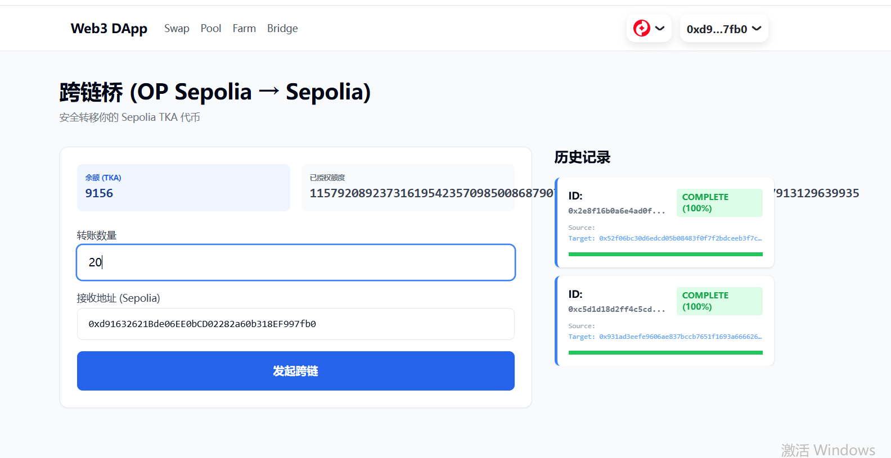
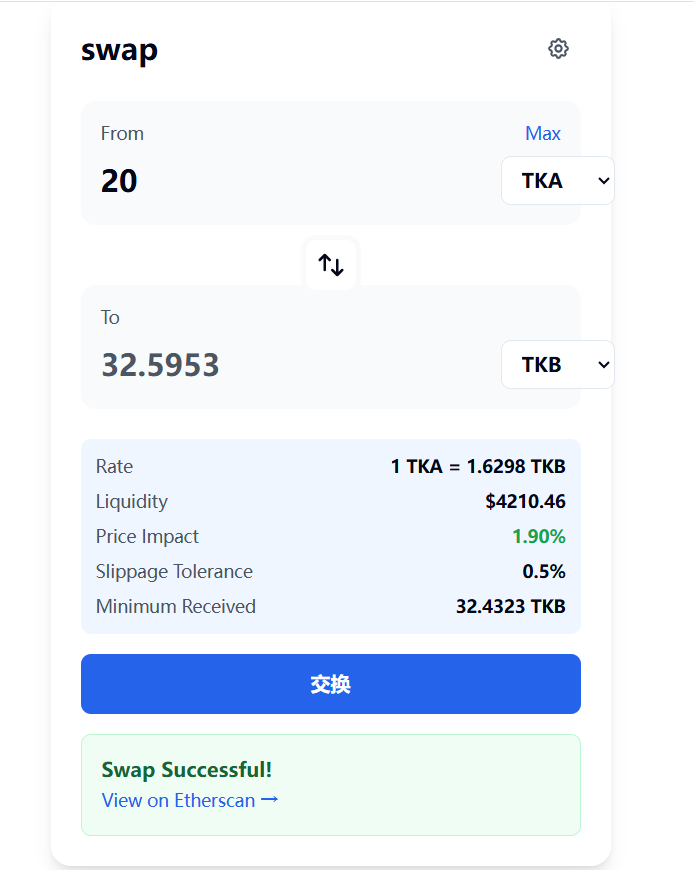
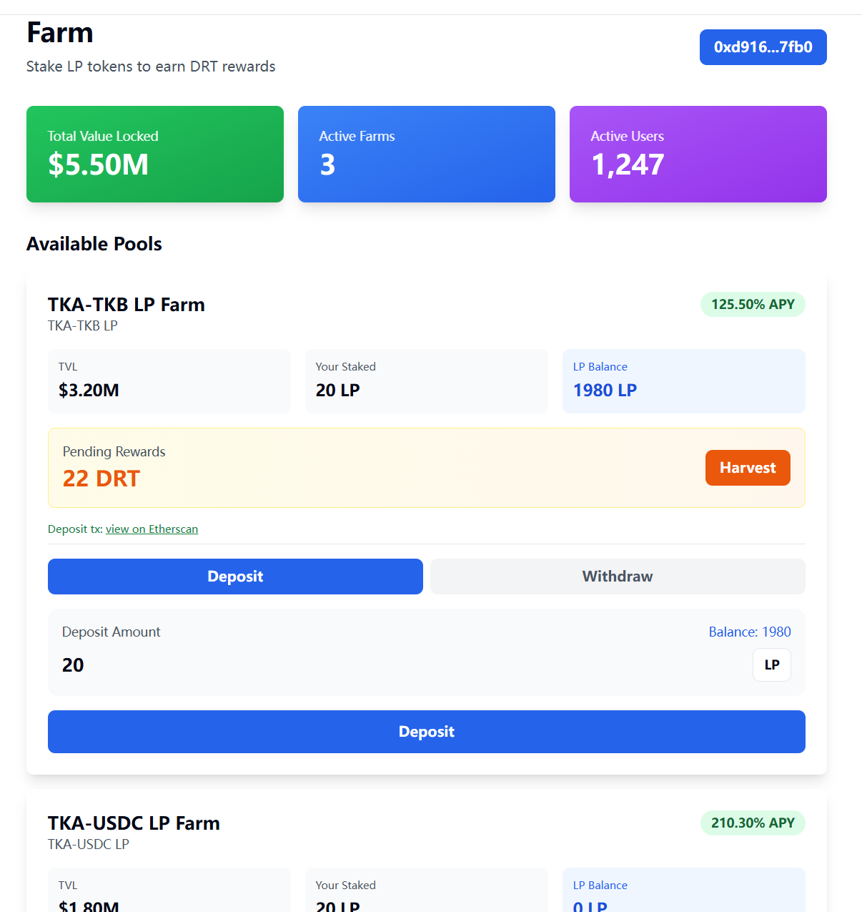
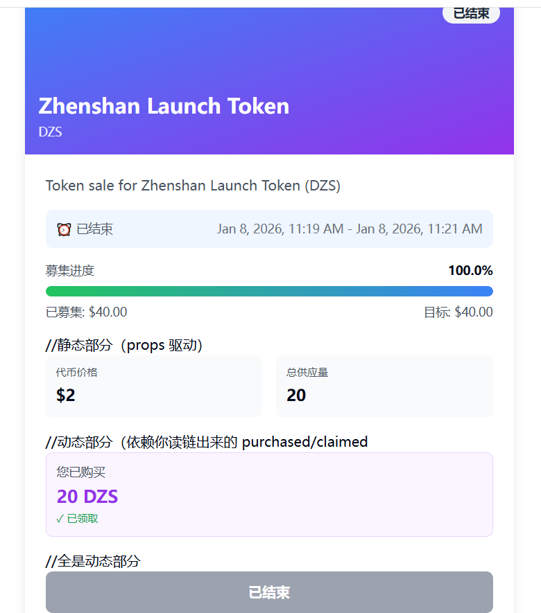

# Web3 DApp �׼���DeFi + Bridge��| Next.js + wagmi/viem

**������ʾ��Live Demo����** https://web3-dapp-two.vercel.app/  
**����֤����On-chain Proofs����** `docs/proofs.md`  
**�ܹ�˵����Architecture����** `docs/ARCHITECTURE.md`  
**��֪���⣨Known Issues����** `docs/KNOWN_ISSUES.md`

һ��ƫ���̻���ص� Web3 DApp ��Ŀ���ϣ����� **Swap/Pool��AMM��**��**Farm����Ѻ�ڿ�**��**Launchpad��IDO��**��**Bridge��OP Sepolia �� Sepolia��** �ĸ�ģ�顣  
�ص㸲�ǣ����Ͻ����ջ��������������� UI ״̬��ģ����ѯ�������ƣ�in-flight�������� receipt/event �Ľ����������ɸ�������֤�ݡ�

---

## �ؼ�ʵ�ֵ�
- **������������ UI ״̬��ģ**��submit �� confirming �� success / failed����ģ��ͳһ�ھ���
- **��ѯ��������**��in-flight ���ظ����� + AbortController ����ж�غ��д
- **Bridge �¼������ջ�**��Դ�� tx �� ��˽��� receipt/logs �� transferId �� Ŀ���� mint �� ǰ��״̬����ѯ
- **�������ַ��ȫ**��ͳһ Address У������������������ string/0x/BigInt ����������ʱ�빹������

---

## ��ͼ��Screenshots��

### Bridge��OP Sepolia �� Sepolia��


### Swap / Pool��AMM��


### Farm����Ѻ��


### Launchpad��IDO��


---

## ģ�鹦�ܣ�Features��

### Swap / Pool��AMM��
- allowance/approve �� addLiquidity �� swap �� removeLiquidity
- BigInt ���ȴ�����parseUnits / formatUnits��
- UI ״̬�ֲ㣬���� pending/success �������ظ��ύ

### Farm��Staking / Yield Farming��
- approve �� deposit �� harvest �� withdraw
- **�������**��ǰ��Ĭ�� `pid = 0`
- ��Ѻ��Ϊ **�Զ��� ERC20**���� AMM �� LP token��

### Launchpad��IDO��
- ������������ UI��BEFORE / ACTIVE / FINISHED / CLAIMABLE
- approve �� contribute �� claim ˳��У���붵����ʾ

### Bridge��OP Sepolia �� Sepolia��
һ������ **Դ���¼� + ��˽�����ִ + Relayer ����** ����С���� Demo���û��� OP Sepolia �����ײ� **burn�����٣�** ���ң�Դ���¼�Я�� `transferId` �ȹؼ���������˽��� OP Sepolia �� `receipt/logs` ���������� Sepolia ִ�� `mintFromSource` ���Ŀ�������ҡ�ǰ����״̬��չʾ�������Ȳ�֧��ˢ�»ָ���

#### ����
1. **OP Sepolia**��������Ҫ�� `approve`���ٵ��� `bridge(amount, recipient, dstChainId)`��Դ�� **burn�����٣�** �������¼�  
2. **���**������Դ�� `receipt/logs` �õ� `transferId`������������¼�����ٷ���  
3. **Relayer����ˣ�**���� **Sepolia** ���� `mintFromSource(transferId, recipient, amount)`��д�� `targetTxHash`���ȴ���ִȷ��  
4. **ǰ��**����ѯ `GET /api/bridge/transfer?transferId=...`������״̬����`queued �� inflight �� complete / failed`

#### ʵ��Ҫ��
- **ǰ��״̬��**��`queued / inflight / complete / failed`����� `progress` �ٷֱ�չʾ
- **��ѯ��������**��in-flight guard + AbortController�������ظ�������ж�غ� setState
- **ˢ�»ָ�**��ʹ�� localStorage ������� N �� `transferId`��ˢ�º��Զ��ָ��б���������ѯ
- **��� quick return**������ⷵ�� `transferId`��mint ���ִȷ���ں�̨�첽ִ�У���������״̬

#### Vercel Relayer ˵��
- Relayer ������ Vercel Serverless �ϣ��ʺϡ����󴥷�ʽִ�С�
- Serverless �����������ڴ�״̬����֤�־û���������¼�־û����Լ� `docs/KNOWN_ISSUES.md`
- Relayer ˽Կ������ڷ���˻��������У������� burner key��

---

## 3 �������飨How to Try��

### ǰ��
- ��װ MetaMask�������� EVM Ǯ����
- ׼�����Աң�
  - **Sepolia ETH**��Swap/Pool/Farm/Launchpad��
  - **OP Sepolia ETH**��Bridge��

### ���·��
1. ��������ʾ������Ǯ��
2. **Swap/Pool��Sepolia��**��Approve TokenA �� Add Liquidity �� Swap �� Remove Liquidity
3. **Farm��Sepolia��**��Approve StakingToken �� Deposit��pid=0���� Harvest �� Withdraw
4. **Launchpad��Sepolia��**��Approve PaymentToken �� Contribute �� Claim
5. **Bridge��OP Sepolia �� Sepolia��**���е� OP Sepolia �� Approve TokenA �� Bridge �� �ȴ�״̬����

��ʾ���ֳ� faucet / gas / RPC ��������ʧ��ʱ��ֱ�Ӳ鿴 `docs/proofs.md`��ÿ�� tx ��������;˵�����ɺ���ɸ��֡�

---

## ����֤����On-chain Proofs��
- ��Լ��ַ������Խ��׹�ϣ����`docs/proofs.md`
- ÿ�����׸���;˵�������ڸ��������

---

## ����ջ��Tech Stack��
- Next.js��App Router��/ React / TypeScript / Tailwind CSS
- wagmi v2 / viem / RainbowKit
- Next.js Route Handlers��Bridge transfer API �벿��ҵ��ӿڣ�
- Networks��Sepolia / OP Sepolia��ͨ�������������ã�

---

## ��������Running Locally��

### 1����װ����
```bash
npm i


